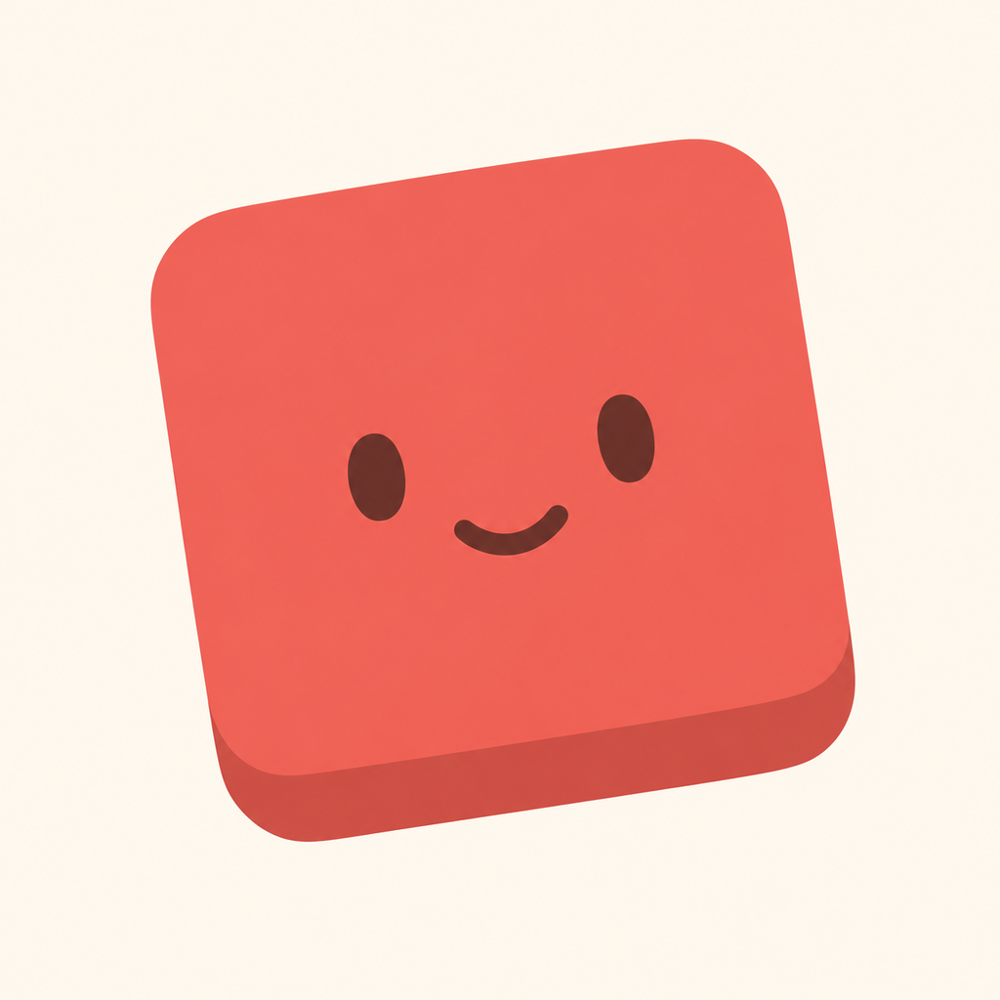
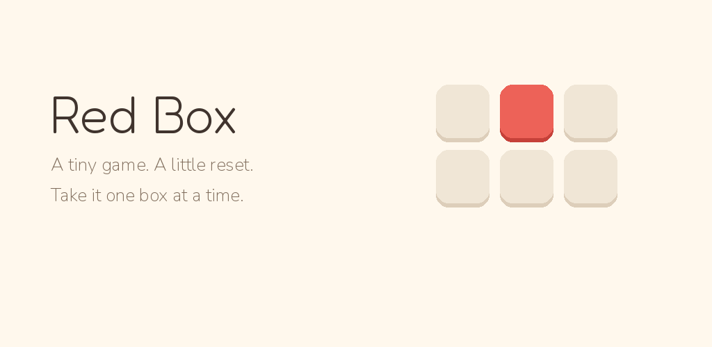
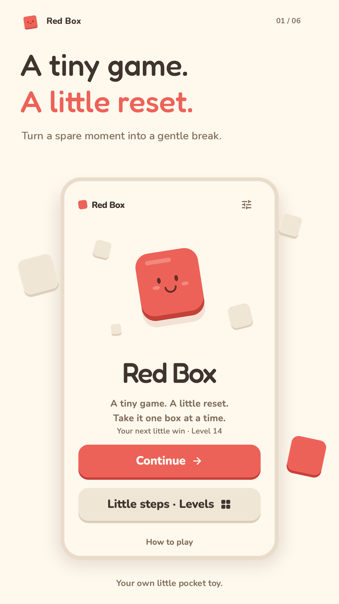
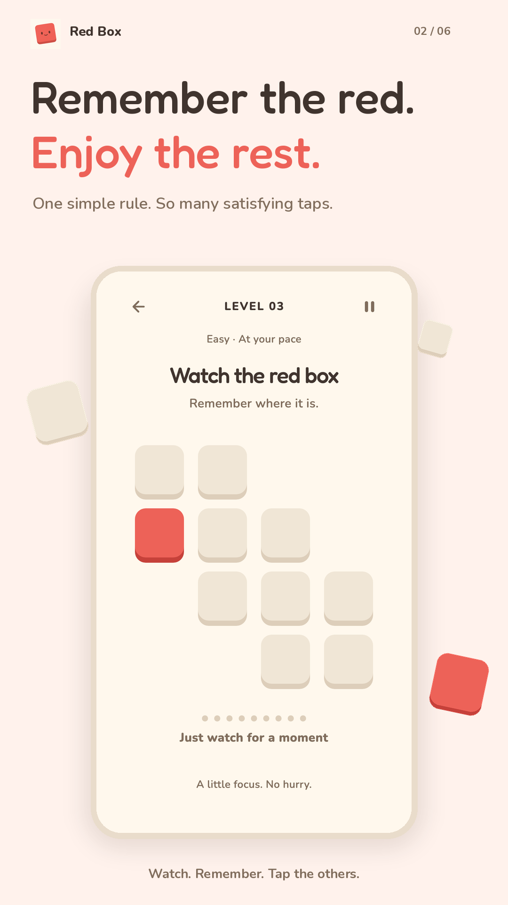
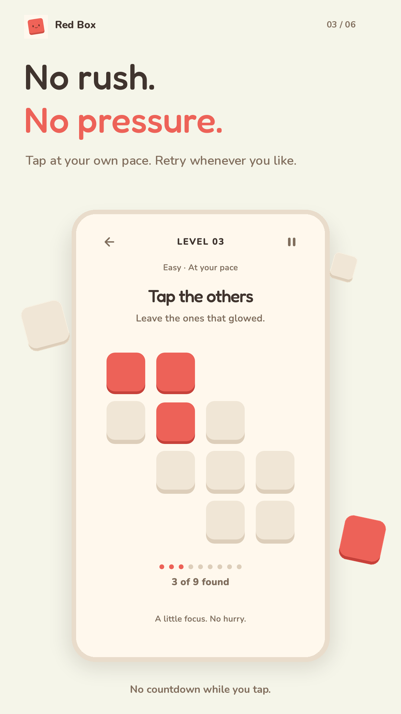
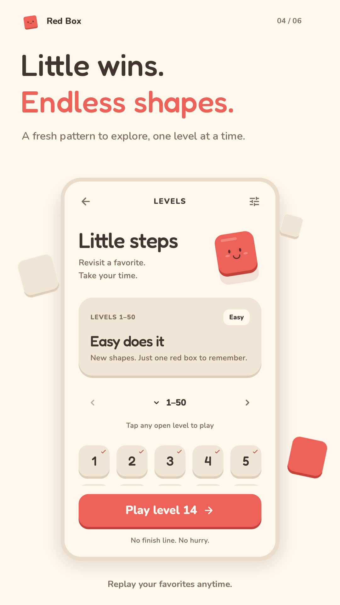
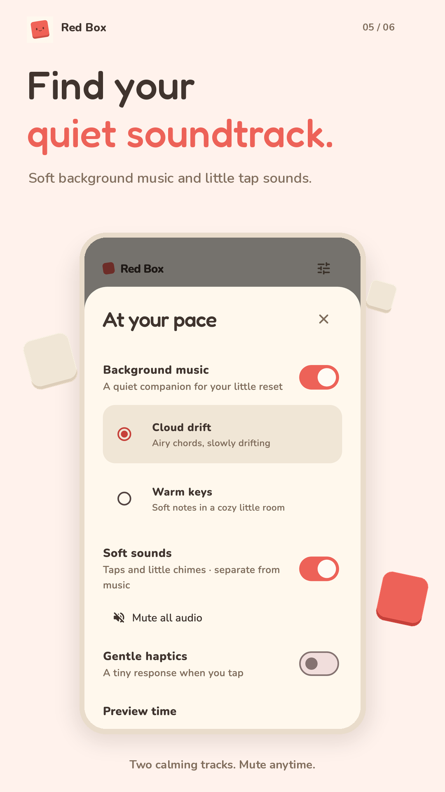
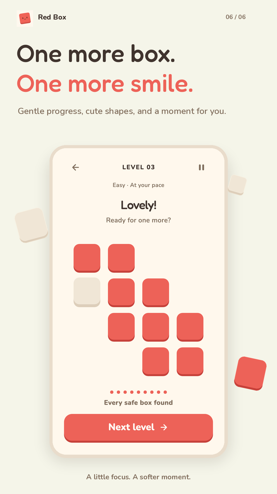

<p align="center">
  
</p>

<h1 align="center">Red Box</h1>
<p align="center"><strong>A tiny game. A little reset.</strong><br>Remember the red boxes, then enjoy tapping the others.</p>
<p align="center">
  <a href="https://sutechs.com/redbox">Red Box website</a> ·
  <a href="https://sutechs.github.io/redbox/">Play in your browser</a> ·
  <a href="https://play.google.com/store/apps/details?id=com.sutechs.redbox">Google Play</a> ·
  <a href="https://apps.apple.com/app/id6818607149">App Store</a> ·
  <a href="https://sutechs.com/privacy">Privacy</a> ·
  <a href="https://sutechs.github.io/redbox/support.html">Support</a>
</p>
<p align="center">Flutter · Android · iOS · Web</p>



## A moment for you

Red Box is a warm, tactile memory game for a gentle break. A few boxes glow red, then fade. Remember them and tap every other box. Each correct tap turns red too, so the board becomes a small, satisfying puzzle. There is no countdown while tapping and no penalty for trying again.

<p align="center">
  
  
  
</p>
<p align="center">
  
  
  
</p>

## The little things

- **Endless, varied shapes.** Seeded silhouettes use 6–16 square boxes; the opening boards have 6, 8, 10, 12, and 9. A gentle curve begins with one red box and gradually mixes one to three.
- **Fresh memories.** Retries and replays choose new red positions. Pause and resume preserve the round.
- **Little steps.** Browse unlocked levels, replay a favorite, or jump to a previous level without losing your progress.
- **Your own quiet soundtrack.** Two original ambient loops, Cloud drift and Warm keys, gentle tap sounds, separate audio switches, and one action to mute everything.
- **Comfort controls.** Longer previews, reduced motion, optional haptics, and a symbol cue for red boxes.
- **A private pocket toy.** No accounts, ads, tracking, or in-app purchases. Progress and preferences stay on your device. The native apps work offline; the web game loads its bundled assets over the internet.

## Run it locally

Use Flutter **3.47.5** with Dart **3.13.4**. Android supports API 24 and newer; iOS supports 15 and newer. The application ID and iOS bundle ID are **`com.sutechs.redbox`**.

```sh
flutter pub get
flutter run
# Or choose the web target:
flutter run -d chrome
```

```sh
flutter analyze
flutter test
flutter build apk --debug
flutter build ios --simulator --debug
flutter build web --release --no-web-resources-cdn --no-wasm-dry-run
```

The tests cover reproducible connected shapes, variety, red-position randomness, full rounds, retry, pause/resume, progress, audio, and fully visible square touch targets on small screens.

## Patterns and design

```dart
final layout = patternForLevel(70, seed: 20261002);
print(layout.mask); // Occupied cells as #, gaps as .
```

```sh
dart run tools/preview_patterns.dart 20261002
# Open design/patterns.html for levels 1–5, 50, 70, 100, and 1000.
```

The approved Pocket toy guide is saved in [design/pocket-toy.html](design/pocket-toy.html). [DESIGN.md](DESIGN.md) documents color, typography, spacing, motion, and board rules; [product.md](product.md) explains gameplay. [The pattern sheet](design/pattern-samples.png) shows the function’s exact output.

## Releases

Find Red Box on [Google Play](https://play.google.com/store/apps/details?id=com.sutechs.redbox), [App Store](https://apps.apple.com/app/id6818607149), or [play online](https://sutechs.github.io/redbox/). Visit [sutechs.com/redbox](https://sutechs.com/redbox) for a little look inside.

[RELEASING.md](RELEASING.md) covers signing, store assets, GitHub Pages, and remaining account steps. Android release builds require a real upload key and fail clearly when signing configuration is missing. Credentials, keystores, and local release files are ignored by Git.

Every push to `main` runs format, analysis, and tests, then builds and deploys the game to GitHub Pages. Pull requests run the checks without deploying. The separate Android workflow can build a signed App Bundle when release secrets are configured; it does not automatically submit to Google Play.

Regenerate the marketing screenshots from the real Flutter UI. iPhone and iPad exports are also preserved under `store/app-store/screenshots/`:

```sh
flutter test tools/capture_screenshots_test.dart
python3 -m pip install Pillow
python3 tools/render_store_assets.py
flutter test tools/capture_screenshots_test.dart --dart-define=SCREENSHOT_DEVICE=iphone
python3 tools/render_store_assets.py --device iphone
flutter test tools/capture_screenshots_test.dart --dart-define=SCREENSHOT_DEVICE=ipad
python3 tools/render_store_assets.py --device ipad
```

## Inside the box

| Path | What lives there |
| --- | --- |
| `lib/game/` | Seeded patterns, randomized red positions, and round state |
| `lib/ui/` | The Pocket toy screens and widgets |
| `lib/core/` | Local preferences, music, and sound |
| `assets/` | Local fonts, original audio, and brand assets |
| `design/` | Approved design guide and pattern sampler |
| `store/` | Store listing copy, feature graphic, icon, and marketing screenshots |
| `web/` | Web startup, icons, privacy, and support pages |

Made by **SuTechs**. Support: **redbox@sutechs.com**.

The source is public for inspection; the game code and brand assets remain © 2026 SuTechs, all rights reserved. See [LICENSE](LICENSE). Third-party packages and fonts retain their own licenses; [THIRD_PARTY_NOTICES.md](THIRD_PARTY_NOTICES.md) records the bundled font notices.
